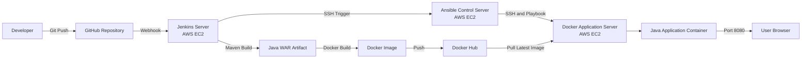

# Automated Java Application CI/CD Pipeline

An end-to-end DevOps project that automatically builds, packages, containerizes and deploys a Java web application using GitHub, Jenkins, Maven, Docker, Docker Hub, Ansible and AWS EC2.

## Project Overview

This project demonstrates a complete CI/CD workflow for a Java web application.

Whenever code is pushed to the GitHub repository:

1. GitHub sends a webhook notification to Jenkins.
2. Jenkins checks out the latest source code.
3. Maven builds the application as a WAR file.
4. Jenkins builds a Docker image.
5. The image is pushed to Docker Hub.
6. Jenkins connects to the Ansible control server through SSH.
7. Ansible pulls the latest image and deploys it on the Docker application server.
8. The application becomes available on port `8080`.

## Architecture

##Technologies Used
AWS EC2
Git and GitHub
GitHub Webhooks
Jenkins
Maven
Java
Apache Tomcat
Docker
Docker Hub
Ansible
Ubuntu Linux
SSH
YAML
Groovy Pipeline

##AWS Infrastructure
The project uses three Ubuntu EC2 instances:
| Server         | Purpose                                      |
| -------------- | -------------------------------------------- |
| Jenkins Server | Builds the Java application and Docker image |
| Ansible Server | Automates configuration and deployment       |
| Docker Server  | Runs the Java application container          |

##CI/CD Pipeline Stages
The Jenkins pipeline contains the following stages:

Verify the build environment
Checkout source code
Build the application using Maven
Verify the WAR artifact
Build the Docker image
Authenticate with Docker Hub
Push versioned and latest Docker images
Trigger the Ansible deployment playbook
Verify successful deployment

##Application Artifact

Maven generates:

- target/java-webapp.war

The Dockerfile deploys the WAR file as:

- /usr/local/tomcat/webapps/ROOT.war

The application runs using Apache Tomcat on:

- Port 8080
Docker Image
- vishwanathv/java-webapp

The Jenkins pipeline pushes two tags:

 vishwanathv/java-webapp:<jenkins-build-number>
- vishwanathv/java-webapp:latest

##Ansible Automation

The Ansible control server manages the Docker application server through SSH.

The included playbooks perform the following operations:

install-docker.yml
Configures Docker’s package repository
Installs Docker Engine
Starts and enables the Docker service
Adds the Ubuntu user to the Docker group
Verifies the Docker installation
deploy-java-app.yml
Pulls the latest application image
Creates or updates the Java container
Publishes container port 8080
Configures an automatic restart policy
Waits for the application port to become available

##Repository Structure
.
├── ansible
│   ├── inventory
│   │   └── hosts.ini.example
│   └── playbooks
│       ├── deploy-java-app.yml
│       └── install-docker.yml
├── docs
│   ├── architecture
│   └── screenshots
├── scripts
│   └── project3-deploy.sh.example
├── src
├── Dockerfile
├── Jenkinsfile
├── pom.xml
├── .gitignore
└── README.md

##Security Practices

SSH port 22 is restricted to trusted sources.
EC2 instances communicate using private IP addresses.
Dedicated SSH keys are used between Jenkins, Ansible and Docker servers.
Docker Hub credentials are stored in Jenkins Credentials.
Tokens and passwords are not included in the Jenkinsfile.
Private keys and real inventory files are excluded through .gitignore.
Jenkins credentials are referenced using a credential ID.

##Jenkins Credential

The Jenkins pipeline expects a username-and-password credential with this ID:

- dockerhub-credentials

The password field should contain a Docker Hub personal access token.

##Sample Ansible Inventory

Copy the example inventory:

cp ansible/inventory/hosts.ini.example ansible/inventory/hosts.ini

Replace:

DOCKER_SERVER_PRIVATE_IP

with the private IP of the Docker application server.

Never commit the real inventory file or SSH private keys.

##Run the Ansible Playbooks

Install Docker:

ansible-playbook ansible/playbooks/install-docker.yml

Deploy the Java application:

ansible-playbook ansible/playbooks/deploy-java-app.yml

##Deployment Result

A successful pipeline performs:
GitHub Push
→ Jenkins Build
→ Maven WAR
→ Docker Image
→ Docker Hub
→ Ansible Deployment
→ Running Java Container
The deployed application is accessible through:

http://DOCKER-SERVER-PUBLIC-IP:8080

##Key Learning Outcomes
Designed a multi-server CI/CD architecture on AWS
Automated Java builds using Maven
Created Jenkins Declarative Pipelines
Built and versioned Docker images
Used Jenkins credentials securely
Automated Docker installation and deployment using Ansible
Configured SSH communication between DevOps servers
Integrated GitHub webhooks for automatic pipeline triggering
Applied basic AWS security-group and cost-management practices

##Author

Vishwanath Vishwakarma
